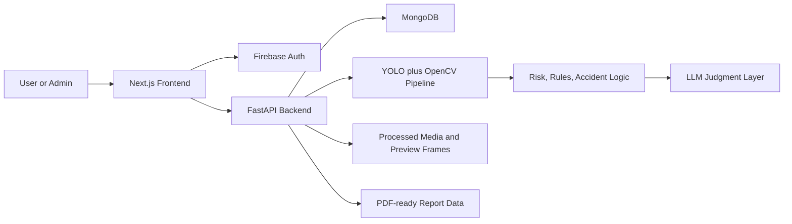
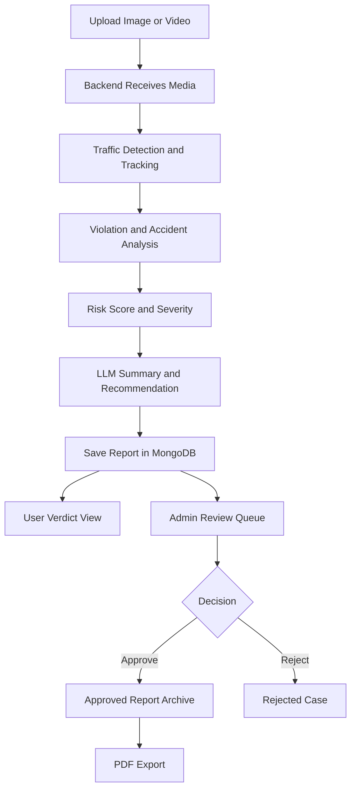

# TraffixAI

<div align="center">

### AI traffic intelligence for uploads, incident triage, admin review, and report export

[](#tech-stack)
[](#tech-stack)
[](#tech-stack)
[](#tech-stack)
[](#ai-pipeline)

Turn raw traffic media into structured evidence with AI detection, risk scoring, legal-style summaries, admin workflows, and downloadable reports.

</div>

---

## Why TraffixAI

Traffic footage is noisy, long, and hard to interpret quickly. TraffixAI compresses that chaos into an operational workflow:

- upload an image or video
- detect vehicles, pedestrians, violations, and accident signals
- score severity and risk
- generate structured verdict-style summaries
- route incidents to admin review
- archive approved cases as exportable reports

This makes the project feel less like a detector demo and more like a real incident intelligence product.

---

## Highlights

| Area | What it does |
| --- | --- |
| Smart uploads | Accepts road images and CCTV-style videos for analysis |
| AI vision pipeline | Uses YOLO, OpenCV, tracking, and rules to detect traffic events |
| Risk intelligence | Computes accident severity, density-aware risk, and incident context |
| Judgment layer | Produces LLM-backed summaries and recommended actions |
| Admin operations | Supports review queues, approval, rejection, and escalation |
| Report archive | Preserves approved incidents for later review and PDF export |
| Modern frontend | Built with Next.js, TypeScript, Tailwind, Framer Motion, and charts |

---

## Experience Map

### User side

- Sign in with Firebase authentication
- Upload image or video evidence
- View AI analysis, verdict, and preview frames
- Wait for review outcome
- Access approved reports and export them as PDF

### Admin side

- Review incoming cases in the admin dashboard
- Inspect richer evidence and boxed incident frames
- Approve or reject reports
- Trigger emergency escalation for high-risk cases

---

## System Flow



---

## Product Journey



---

## Tech Stack

### Frontend

- Next.js 14
- React 18
- TypeScript
- Tailwind CSS
- Framer Motion
- React Three Fiber and Drei
- Recharts and Chart.js
- jsPDF and html2canvas

### Backend

- FastAPI
- Python
- OpenCV
- NumPy
- Ultralytics YOLO
- Pydantic
- PyMongo
- Twilio

### Platform

- Firebase Authentication
- Firebase Admin SDK
- MongoDB
- Local media storage for development

---

## AI Pipeline

TraffixAI combines classic CV structure with application-level reasoning:

1. Detection  
   YOLO identifies traffic-relevant objects such as cars, trucks, buses, motorcycles, and pedestrians.

2. Tracking and motion analysis  
   Video objects are tracked over time to infer motion, overlap, velocity shifts, and suspicious interactions.

3. Rule engine  
   Detection output is translated into higher-level traffic events like no helmet, jaywalking, tailgating, wrong-way driving, lane changes, stopped vehicles, and U-turns.

4. Accident logic  
   The backend evaluates overlap, motion changes, cooldown windows, and scene cues to detect possible collisions and crash-like events.

5. Risk and severity scoring  
   Violations, accidents, and density contribute to a structured risk result.

6. LLM-backed judgment  
   Structured outputs are summarized into verdict-style explanations and recommended actions.

---

## Core Features

### User features

- Upload image or video evidence
- View annotated results and compact evidence previews
- Read verdict and legal-style summary output
- Track approved incidents from a personal dashboard
- Export approved reports as PDF

### Admin features

- Review pending requests in a dedicated queue
- Inspect richer evidence for incident validation
- Approve or reject reports
- Manage user roles
- Send emergency escalation alerts
- Monitor overview analytics

### Developer-friendly strengths

- Clear user and admin separation
- Full-stack architecture with real backend workflows
- Practical AI-to-product pipeline instead of isolated inference
- Strong portfolio value for CV, dashboards, and applied AI systems

---

## Project Structure

```text
traffixai/
├─ frontend/
│  ├─ app/
│  ├─ components/
│  ├─ contexts/
│  ├─ lib/
│  ├─ public/
│  └─ package.json
├─ backend/
│  ├─ ai/
│  ├─ detection/
│  ├─ uploads/
│  ├─ processed/
│  ├─ main.py
│  └─ requirements.txt
├─ database/
│  └─ mongodb_schema.js
├─ firebase/
└─ README.md
```

### Important directories

- `frontend/app` contains routes like `upload`, `verdict`, `dashboard`, `reports`, `admin`, `judge`, and auth pages.
- `frontend/components` holds reusable UI, animated sections, and layout primitives.
- `frontend/contexts` includes client auth/session context.
- `frontend/lib` contains shared helpers and API utilities.
- `backend/main.py` is the FastAPI entry point for uploads, reports, admin actions, analytics, and auth-aware APIs.
- `backend/ai` and `backend/detection` contain the vision, judgment, and event-detection logic.
- `database/mongodb_schema.js` helps initialize the MongoDB schema.

---

## API Surface

### Health and auth

- `GET /`
- `GET /health`
- `GET /api/health`
- `POST /auth/sync-user`

### Media analysis

- `POST /upload-image`
- `POST /upload-video`
- `GET /analysis-result/{report_id}`
- `POST /api/upload`
- `POST /api/analyze-image`

### Reports and dashboard

- `GET /reports`
- `PATCH /reports/{report_id}`
- `DELETE /reports/{report_id}`
- `POST /reports/forward`
- `GET /dashboard/stats`
- `GET /analytics/user/density`

### Admin and operations

- `GET /admin/requests`
- `PATCH /admin/requests/{request_id}`
- `GET /users`
- `PATCH /admin/users/{user_id}/role`
- `POST /admin/send-emergency`
- `GET /analytics/admin/overview`

### Intelligence helpers

- `POST /predict-risk`
- `POST /send-alert`
- `POST /route-safety-recommendation`
- `POST /api/traffic-law-query`
- `POST /api/traffic-law-from-analysis`
- `POST /api/generate-dashboard`
- `POST /api/executive-summary`
- `GET /ws/monitor/{video_id}`

---

## Quick Start

### 1. Clone the repository

```bash
git clone https://github.com/aadidevj007/TraffixAi.git
cd TraffixAi
```

### 2. Install frontend dependencies

```bash
cd frontend
npm install
```

Create `frontend/.env.local`:

```env
NEXT_PUBLIC_FIREBASE_API_KEY=...
NEXT_PUBLIC_FIREBASE_AUTH_DOMAIN=...
NEXT_PUBLIC_FIREBASE_PROJECT_ID=...
NEXT_PUBLIC_FIREBASE_STORAGE_BUCKET=...
NEXT_PUBLIC_FIREBASE_MESSAGING_SENDER_ID=...
NEXT_PUBLIC_FIREBASE_APP_ID=...
NEXT_PUBLIC_API_URL=http://localhost:8000
```

### 3. Install backend dependencies

```bash
cd backend
python -m venv venv
venv\Scripts\activate
pip install -r requirements.txt
```

If you hit NumPy compatibility issues:

```bash
pip install "numpy<2" --force-reinstall
pip install -r requirements.txt --upgrade
```

Create `backend/.env`:

```env
PORT=8000
CORS_ORIGINS=http://localhost:3000
MONGODB_URI=mongodb+srv://<username>:<password>@<cluster>.mongodb.net/?retryWrites=true&w=majority
MONGODB_DB=traffixai
FIREBASE_CREDENTIALS_PATH=../firebase/serviceAccountKey.json
YOLO_MODEL_PATH=./models/accident_model.pt
```

### 4. Initialize MongoDB schema

```bash
mongosh "mongodb+srv://<username>:<password>@<cluster>.mongodb.net/traffixai?retryWrites=true&w=majority" ../database/mongodb_schema.js
```

### 5. Run the backend

```bash
cd backend
python main.py
```

### 6. Run the frontend

```bash
cd frontend
npm run dev
```

### Local URLs

- Frontend: `http://localhost:3000`
- Backend: `http://localhost:8000`

---

## Deployment Notes

### Recommended split

- Frontend: Vercel
- Backend: Render, Railway, VPS, or Docker host
- Database: MongoDB Atlas
- Authentication: Firebase
- Media storage: object storage instead of local disk

### Production caution

The current local development flow writes uploaded and processed media into:

- `backend/uploads`
- `backend/processed`

That is fine for local development, but not ideal for production or serverless deployment. A durable object store like S3, Cloudinary, R2, Supabase Storage, or Firebase Storage is the better long-term direction.

---

## Report Export

Approved reports can be turned into portable PDF summaries by:

1. fetching full incident analysis
2. resolving preview-safe evidence media
3. rendering an export layout
4. converting the layout into a downloadable PDF in the browser

This gives each approved case a sharable artifact instead of leaving the result trapped inside the UI.

---

## Security Model

### Regular users

- authenticate with Firebase
- upload and review their own incident submissions
- access verdicts and approved report history

### Admins

- access protected admin routes
- review richer evidence
- approve or reject incidents
- trigger escalations and user-management actions

### Backend protections

- Firebase token verification
- role-based access for admin endpoints
- structured separation between user and admin workflows

---

## What Makes It Stand Out

TraffixAI is compelling because it connects multiple disciplines into one workflow:

- computer vision
- applied rules and scoring
- LLM-backed report intelligence
- dashboard UX
- admin operations
- report archival

It is the kind of project that reads well both as a portfolio showcase and as a foundation for a more serious smart-mobility product.

---

## Suggested Next Upgrades

- move media storage to a durable cloud bucket
- add background job handling for longer video processing
- expand automated tests for upload and report flows
- harden very large PDF export cases
- add richer observability around model and pipeline performance

---

## License

No license is currently specified in this repository. Add one if you want to define reuse terms clearly.
