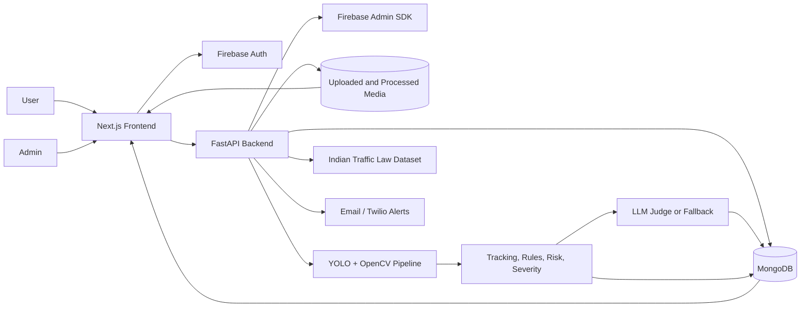
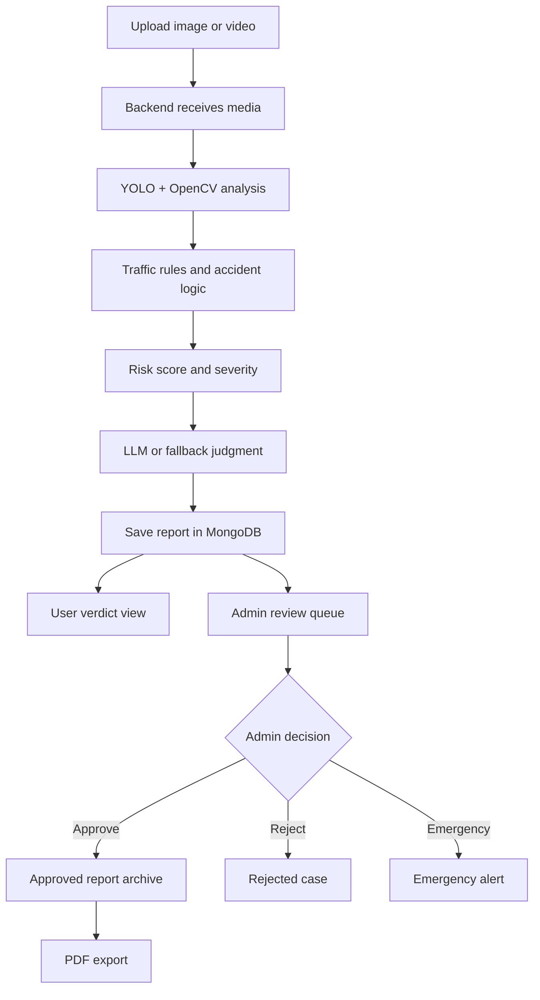
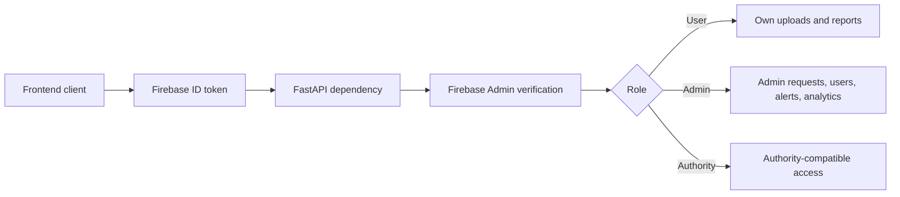

# TraffixAI

<div align="center">

## AI-Powered Traffic Intelligence Platform

Turn raw traffic images and CCTV-style video into structured evidence, risk scores,
admin decisions, emergency alerts, and export-ready incident reports.

[](#tech-stack)
[](#tech-stack)
[](#ai-pipeline)
[](#tech-stack)
[](#security-model)

**Uploads. Detection. Judgment. Review. Reports.**

</div>

---

## Overview

TraffixAI is a full-stack smart mobility system for analyzing traffic evidence. It
combines a modern Next.js interface, a FastAPI inference backend, YOLO/OpenCV
computer vision, MongoDB persistence, Firebase authentication, LLM-assisted
judgment, and admin review workflows.

The result is more than a detector demo: it is an incident intelligence workflow
that helps users submit evidence, helps admins validate cases, and turns approved
incidents into portable PDF reports.

---

## What TraffixAI Does

| Capability | Description |
| --- | --- |
| Smart media analysis | Upload images or videos and receive annotated evidence with detected objects, violations, accidents, and confidence data. |
| Traffic event reasoning | Converts raw detections into higher-level events such as no helmet, wrong-way driving, tailgating, jaywalking, lane changes, stopped vehicles, U-turns, and accident signals. |
| Risk and severity scoring | Combines violations, accident signals, and density into a practical risk result. |
| LLM judgment layer | Uses Cloudflare Llama when configured, with rule-based fallback behavior when LLM credentials are missing. |
| Admin operations | Routes cases to a protected admin dashboard for approval, rejection, escalation, and user-role management. |
| Report archive | Stores approved incidents and exports rich case summaries as browser-generated PDFs. |
| Route safety advice | Compares planned routes against approved accident records and returns safety recommendations. |

---

## Product Experience

| User Journey | Admin Journey |
| --- | --- |
| Sign in with Firebase | Enter the protected admin workspace |
| Upload image or video evidence | Review forwarded incident requests |
| View annotated AI analysis | Inspect evidence, severity, risk, events, and LLM summaries |
| Read the verdict and recommended action | Approve, reject, or trigger emergency escalation |
| Track report status | Monitor analytics and manage user roles |
| Export approved reports as PDF | Keep validated incident records organized |

---

## System Architecture



For a deeper project map, see [docs/PROJECT_FLOWCHART.md](docs/PROJECT_FLOWCHART.md).

---

## Core Workflow



---

## AI Pipeline

1. **Detection**  
   YOLO identifies traffic-relevant objects such as cars, trucks, buses,
   motorcycles, bicycles, pedestrians, and traffic lights.

2. **Tracking and motion analysis**  
   Video frames are sampled and tracked to infer movement, overlap, velocity
   shifts, stopped vehicles, direction changes, and suspicious interactions.

3. **Rule engine**  
   Detection output is interpreted as traffic events: no helmet, excess riders,
   jaywalking, tailgating, wrong-way driving, lane changes, red-light situations,
   stopped vehicles, speeding-like behavior, and U-turns.

4. **Accident logic**  
   The backend evaluates overlap, deceleration, cooldowns, fallen-bike cues, and
   crash-model signals when configured.

5. **Risk and severity scoring**  
   Violations, accidents, and vehicle density are converted into a structured
   risk score and severity level.

6. **Judgment layer**  
   The result is summarized into a verdict, confidence estimate, recommended
   action, legal-style context, and admin routing decision.

---

## Feature Matrix

| Area | Features |
| --- | --- |
| Authentication | Firebase login, signup, Google login, local admin fallback, backend token verification |
| Uploads | Image upload, video upload, progress handling, preview rendering, annotated output |
| Analysis | Object detection, tracking, violation detection, accident detection, density metrics |
| Verdicts | Risk meter, severity, evidence previews, event breakdown, recommended action |
| Reports | User report history, status filtering, full detail fetch, PDF export |
| Admin | Request queue, accepted/rejected tabs, emergency WhatsApp action, user role updates |
| Analytics | Dashboard stats, density trends, admin overview charts, violation distribution |
| Intelligence | Route safety recommendation, traffic-law query helpers, executive summaries |

---

## Tech Stack

### Frontend

- Next.js 14
- React 18
- TypeScript
- Tailwind CSS
- Framer Motion
- React Three Fiber and Drei
- Recharts and Chart.js
- jsPDF and html2canvas
- Firebase client SDK

### Backend

- FastAPI
- Python
- OpenCV
- NumPy
- Ultralytics YOLO
- Pydantic
- PyMongo
- Firebase Admin SDK
- Twilio
- HTTPX

### Data And Platform

- MongoDB / MongoDB Atlas
- Firebase Authentication
- Firebase Firestore rules
- Local media storage for development
- Render/Vercel deployment configuration

---

## Project Structure

```text
traffixai/
├─ frontend/
│  ├─ app/                 # Next.js routes and pages
│  ├─ components/          # UI, charts, layout, chat, location input
│  ├─ contexts/            # Auth context
│  ├─ lib/                 # API, Firebase, media helpers
│  └─ package.json
├─ backend/
│  ├─ ai/                  # LLM judge and traffic monitor
│  ├─ detection/           # Tracking, velocity, rules, visualization helpers
│  ├─ models/              # YOLO / accident model weights
│  ├─ main.py              # FastAPI app, routes, processing orchestration
│  └─ requirements.txt
├─ data/
│  └─ indian-traffic-laws.json
├─ database/
│  └─ mongodb_schema.js
├─ docs/
│  └─ PROJECT_FLOWCHART.md
├─ firebase/
├─ render.yaml
└─ README.md
```

---

## API Surface

| Group | Endpoints |
| --- | --- |
| Health and auth | `GET /`, `GET /health`, `GET /api/health`, `POST /auth/sync-user` |
| Media analysis | `POST /upload-image`, `POST /upload-video`, `GET /analysis-result/{report_id}` |
| Reports | `GET /reports`, `PATCH /reports/{report_id}`, `DELETE /reports/{report_id}`, `POST /reports/forward` |
| Admin | `GET /admin/requests`, `PATCH /admin/requests/{request_id}`, `GET /users`, `PATCH /admin/users/{user_id}/role` |
| Alerts | `POST /send-alert`, `POST /admin/send-emergency` |
| Analytics | `GET /dashboard/stats`, `GET /analytics/user/density`, `GET /analytics/admin/overview` |
| Intelligence | `POST /predict-risk`, `POST /route-safety-recommendation`, traffic-law and executive-summary compatibility APIs |
| Legacy realtime | `POST /api/upload`, `POST /api/analyze-image`, `WebSocket /ws/monitor/{video_id}` |

---

## Quick Start

### Prerequisites

- Node.js 18+
- Python 3.10+
- MongoDB Atlas or local MongoDB
- Firebase project
- YOLO model weights in `backend/models` or a configured `YOLO_MODEL_PATH`

### 1. Clone

```bash
git clone https://github.com/aadidevj007/TraffixAi.git
cd TraffixAi
```

### 2. Configure the frontend

```bash
cd frontend
npm install
```

Create `frontend/.env.local`:

```env
NEXT_PUBLIC_FIREBASE_API_KEY=...
NEXT_PUBLIC_FIREBASE_AUTH_DOMAIN=...
NEXT_PUBLIC_FIREBASE_PROJECT_ID=...
NEXT_PUBLIC_FIREBASE_STORAGE_BUCKET=...
NEXT_PUBLIC_FIREBASE_MESSAGING_SENDER_ID=...
NEXT_PUBLIC_FIREBASE_APP_ID=...
NEXT_PUBLIC_API_URL=http://localhost:8000
```

### 3. Configure the backend

```bash
cd ../backend
python -m venv venv
venv\Scripts\activate
pip install -r requirements.txt
```

Create `backend/.env`:

```env
PORT=8000
CORS_ORIGINS=http://localhost:3000
MONGODB_URI=mongodb+srv://<username>:<password>@<cluster>.mongodb.net/?retryWrites=true&w=majority
MONGODB_DB=traffixai
FIREBASE_CREDENTIALS_PATH=../firebase/serviceAccountKey.json
YOLO_MODEL_PATH=./models/yolov8n.pt

# Optional intelligence and alerting
CLOUDFLARE_ACCOUNT_ID=
CLOUDFLARE_API_TOKEN=
CLOUDFLARE_LLM_MODEL=@cf/meta/llama-3.1-8b-instruct
TWILIO_ACCOUNT_SID=
TWILIO_AUTH_TOKEN=
TWILIO_FROM_WHATSAPP=
TWILIO_TO_WHATSAPP=
```

If `torch` or `ultralytics` complains about NumPy 2.x, repair the backend virtual
environment:

```bash
python -m pip install "numpy<2" --force-reinstall
pip install -r requirements.txt --upgrade
```

### 4. Initialize MongoDB indexes

```bash
mongosh "mongodb+srv://<username>:<password>@<cluster>.mongodb.net/traffixai?retryWrites=true&w=majority" ../database/mongodb_schema.js
```

### 5. Run the backend

```bash
venv\Scripts\activate
python main.py
```

Backend URL: `http://localhost:8000`

### 6. Run the frontend

```bash
cd ../frontend
npm run dev
```

Frontend URL: `http://localhost:3000`

---

## Deployment

| Layer | Recommended Target |
| --- | --- |
| Frontend | Vercel or Firebase Hosting |
| Backend | Render, Railway, VPS, or container host |
| Database | MongoDB Atlas |
| Authentication | Firebase Authentication |
| Media | S3, Cloudinary, R2, Supabase Storage, or Firebase Storage |

The development backend writes media to local folders:

- `backend/uploads`
- `backend/processed`

That is convenient locally, but production deployments should move uploaded and
processed media to durable object storage.

---

## Security Model



- Regular users can upload media, review their own submissions, and export
  approved reports.
- Admin users can inspect forwarded cases, approve or reject requests, trigger
  emergency alerts, and manage roles.
- Backend dependencies enforce Firebase token verification and admin-only routes.

---

## Report Export

Approved reports can be converted into polished PDF case files. The frontend
fetches full analysis details, resolves media previews, renders a print-ready
layout, captures it with `html2canvas`, and exports it with `jsPDF`.

This turns each approved case into a portable artifact that can be shared outside
the dashboard.

---

## Why It Stands Out

TraffixAI blends several real-world engineering concerns into one cohesive system:

- computer vision inference
- motion-aware event detection
- traffic-law context
- risk scoring
- LLM-backed summaries
- protected admin operations
- analytics dashboards
- browser-side report generation

It reads like a portfolio project, but it is shaped like the foundation of a
smart-city incident triage product.

---

## Roadmap Ideas

- Move media storage to durable cloud object storage.
- Add a background worker queue for long-running video analysis.
- Expand automated tests around uploads, auth, reports, and admin workflows.
- Add observability for model latency, frame throughput, and failed inference.
- Add deployment-ready Docker files for frontend and backend.
- Add stricter audit logs for admin decisions and emergency actions.

---

## License

No license is currently specified in this repository. Add one before publishing
or accepting external reuse.
