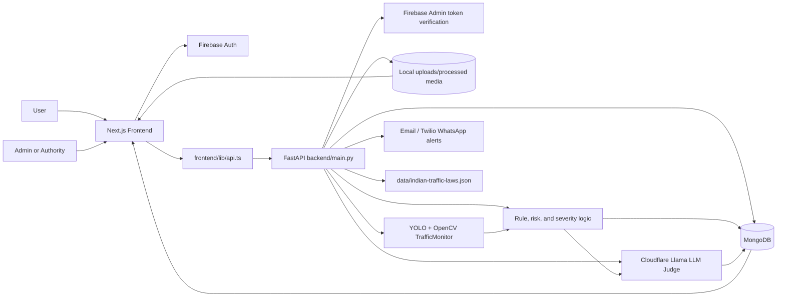
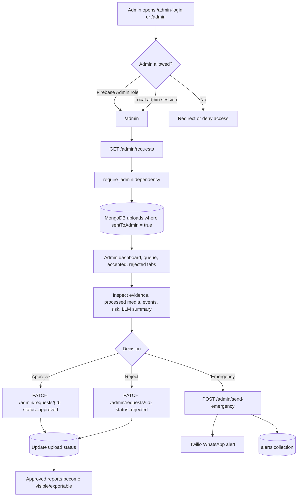
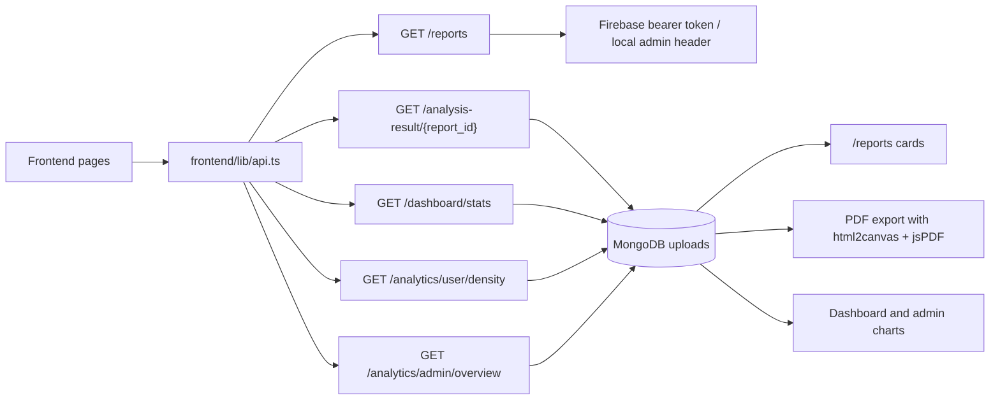
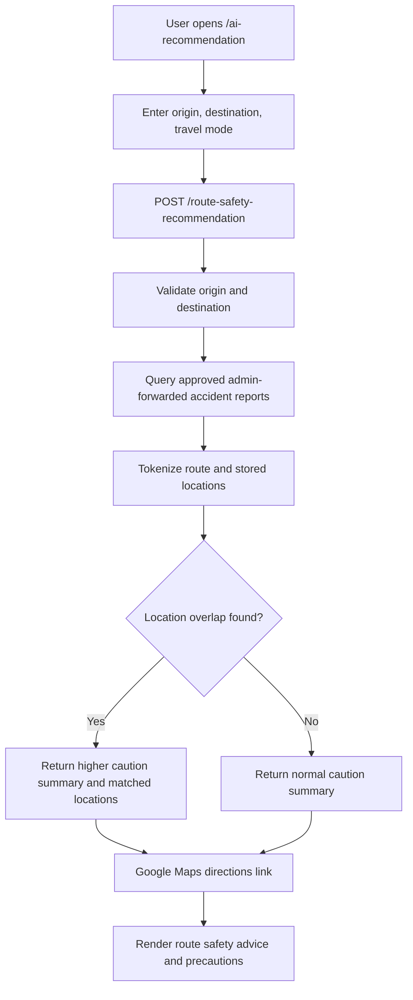
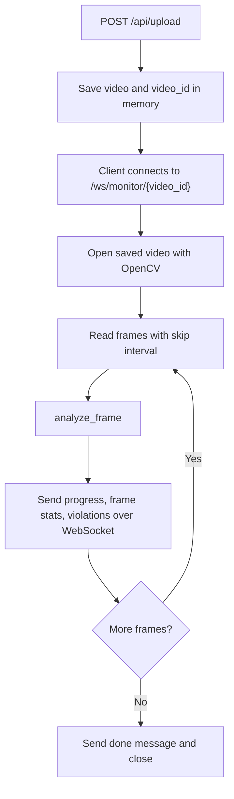
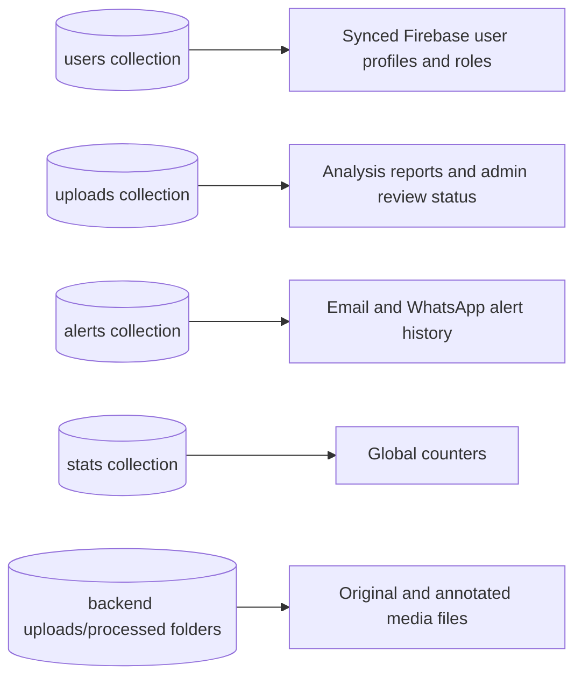

# TraffixAI Project Flowchart

This document maps the main TraffixAI runtime flows across the Next.js frontend,
FastAPI backend, AI detection pipeline, MongoDB persistence, Firebase auth, and
external services.

## 1. System Architecture

## 2. User Upload And Analysis Flow

```mermaid
flowchart TD
    start["User opens /upload"] --> signin{Signed in?}
    signin -->|No| login[Login or signup with Firebase]
    signin -->|Yes| choose[Choose image or video]
    login --> choose

    choose --> meta[Enter location, date, time, description]
    meta --> submit[Submit media]
    submit --> mediaType{Media type}

    mediaType -->|Image| imageApi[POST /upload-image]
    mediaType -->|Video| videoApi[POST /upload-video]

    imageApi --> saveRaw[Save original file in backend uploads]
    videoApi --> saveRaw

    saveRaw --> analyze{Analyze file}
    analyze -->|Image| processImage[process_image]
    analyze -->|Video| processVideo[process_video]

    processImage --> frame[analyze_frame]
    processVideo --> sampleFrames[Read video frames and sample interval]
    sampleFrames --> frame

    frame --> yolo[YOLO object detection and tracking]
    yolo --> trafficRules[TrafficMonitor violation modules]
    trafficRules --> incidents[Objects, boxes, events, violations, accidents]
    incidents --> annotate[Create annotated image or processed video]
    annotate --> risk[_risk_score]
    risk --> judge[LLMJudge or rule fallback]
    judge --> severity[Accident severity and violation judgment]

    severity --> emergency{High severity?}
    emergency -->|Yes| whatsapp[Send emergency WhatsApp if configured]
    emergency -->|No| normalReview[Mark for admin review when applicable]
    whatsapp --> normalReview

    normalReview --> store[_store_upload]
    store --> mongo[(uploads collection)]
    store --> response[Return analysis result to frontend]
    response --> verdict["Redirect to /judge or verdict view"]
    verdict --> reports["User can view /reports and export PDF"]
```

## 3. Admin Review Flow

## 4. Reports, Dashboard, And Analytics Flow

## 5. Route Safety Recommendation Flow

## 6. Legacy Realtime Monitoring Flow

## Main Data Stores

